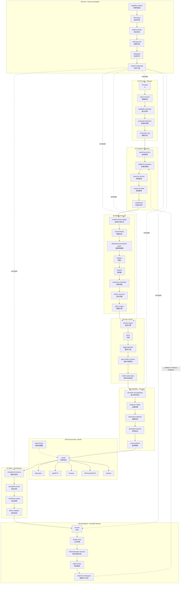
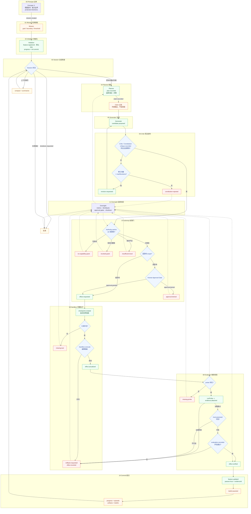

# AI Time Run

> Autonomous agents need a ledger they cannot lie in.
>
> AI Time Run is a managed-agent runtime that decouples the brain from the
> hands and turns every run into an auditable, event-sourced Episode.

AI Time Run 是一个面向长周期自主智能体的运行时。它吸收 Anthropic 的 Harness
工程源头与 OpenAI 的治理实践，把 `Planner - Generator - Evaluator - Critic`
多智能体对抗闭环、大脑/手脚解耦、宪法对齐和事件溯源统一到一条追加式事实账本上。
它同时把 2026 年三篇 arXiv Harness 论文（AI Harness Engineering、Life-Harness、
SafeHarness）落成可运行的机制：Episode 审计包、H0-H3 能力阶梯、熵审计、干预记录。

## 定位

AI Time Run 解决的不是“如何让模型更聪明”，而是长周期 Agent 最难的两个工程问题：

- 跨上下文窗口的进度交接与状态持久化。
- “谁、在什么证据、什么权限下、产生了什么效应”的可审计与可恢复。

为此，它把整个运行时拆成四个可独立部署的组件，并用一条 Session 账本贯穿。

## 核心创新

1. **反事实模拟认知层**：先模拟、后执行。`Simulator` 在沙盒里快照、执行、再回滚，
   把“如果这样做会怎样”写成 `simulation.recorded`，真实世界零副作用。
2. **因果历史与隔离图**：`CausalGraph` 从事件 `parent` 重建显式 DAG，`classifyEffect`
   把高影响副作用标为 `atomic`（不可中断），其余标为 `parallel`（可并行）。
3. **语义信任网关**：`TrustGateway` 强制“不可信内容不能改变信任”。只有可信来源
   且 `ok` 的证据才能翻转功能、信念或权限。
4. **Episode 审计包**：`buildEpisode()` 把一次运行蒸馏成复现日志、失败归因、确定性
   检查、验证报告、熵审计与干预日志，并自动归类到 H0-H3 阶梯。
5. **防篡改 trace viewer**：`renderTraceHtml()` 产出一个自包含 HTML，把每条事件按
   “是否通过不变量层”着色，伪造的“无证据通过 / 越权执行”会直接标红。

## Harness 能力阶梯（H0-H3）

沿用 AI Harness Engineering 的定义，等级由账本里实际存在的证据决定，而不是由
README 声称决定：

| 等级 | 证据结构 | 判定 |
| --- | --- | --- |
| H0 | 只有最终 patch | 无行动轨迹 |
| H1 | 行动/工具轨迹 | 有 `plan.recorded` / `effect.requested` |
| H2 | 证据 + 验证 | 有 `evidence.attached` + `effect.verified` |
| H3 | 完整 Episode 包 | 另有归因、确定性检查、验证报告、熵审计、干预 |

正常演示达到 H2；当一次运行里同时存在通过与失败归因时，`buildEpisode()` 判定为 H3。

## 核心范式

AI Time Run 遵循 `State-Evidence-Authority-Coordination` 四个范式。

| 范式 | 含义 | 落点 |
| --- | --- | --- |
| State | 状态必须能从事件日志重建 | `Ledger + project` |
| Evidence | 模型输出只是主张，被观察后才成证据 | `Claim / Evidence / Belief` |
| Authority | 权限是可执行数据，会话撤销连带权限失效 | `AuthorityEngine` |
| Coordination | 多智能体通过角色、车道、因果链协同 | `Planner/Generator/Critic/Evaluator` |

## 四大组件

| 组件 | 职责 | 实现 |
| --- | --- | --- |
| Session | 追加式事件账本，重放/切片/摘要 | `ledger.ts`、`session.ts` |
| Harness | 编排中枢，多智能体对抗闭环 | `orchestrator.ts` |
| Sandbox | 手脚工具执行，故障隔离，快照恢复 | `sandbox.ts` |
| Orchestration | 调度、权限、审批、监督、信念路由 | `authority.ts`、`oversight.ts`、`memory.ts` |

## MDIBUS V18 九模块蓝图

每个模块不再是一个塞满概念的团簇，而是一条逻辑链：一个节点只承载一个概念，
节点之间的边就是工作流顺序。监督层（09）以虚线反向介入全链路，持久记忆（08）
把结果回灌认知服务（02）。



## 运行时主循环



## 多智能体角色

| 角色 | 职责 | 写入的事件 |
| --- | --- | --- |
| Principal | 定义意图、能力边界，行使审批与停机 | `mission.created`、`approval.*`、`shutdown.requested` |
| Initializer | 初始化环境，登记默认失败的功能清单 | `feature.registered` |
| Planner | 选择功能、分解步骤、产出计划与主张 | `plan.recorded`、`claim.recorded` |
| Generator | 产出候选实现，经宪法修订后交给沙盒 | `candidate.proposed`、`effect.requested` |
| Critic | 按宪法原则批判候选，触发修订 | `critique.recorded`、`revision.requested` |
| Evaluator | 运行探测、采集证据、做客观评估 | `evidence.attached`、`evaluation.recorded`、`effect.verified`、`feature.updated` |
| Observer | 提供外部环境观测与信任判定 | `trust.assessed` |

## 事件模型

所有事件追加到 `Ledger`，每条事件包含：
`id / seq / at / type / actor / payload / parent / evidence`。

| 事件 | 含义 |
| --- | --- |
| `mission.created` | 主体意图契约与能力边界 |
| `feature.registered` | 默认失败的测试契约 |
| `plan.recorded` | 规划者产出的计划 |
| `claim.recorded` | 作者主张，不是真相 |
| `candidate.proposed` | 生成器候选 |
| `critique.recorded` | 批判者审查 |
| `revision.requested` | 宪法修订请求 |
| `grant.issued` / `grant.revoked` | 能力授权与撤销 |
| `approval.granted` / `approval.denied` | 人工审批门 |
| `effect.requested` / `actualized` / `verified` / `reverted` | 副作用生命周期 |
| `checkpoint.created` / `rollback.requested` | 可逆性 |
| `evidence.attached` | 探测证据 |
| `evaluation.recorded` | 评估者结论 |
| `trust.assessed` | 信任判定 |
| `simulation.recorded` | 反事实模拟 |
| `conjecture.recorded` / `conjecture.resolved` | 猜想调度 |
| `belief.asserted` / `belief.retracted` | 信念与墓碑 |
| `feature.updated` | 只有带证据才能翻转 |
| `failure.attributed` | 失败八分类归因（context/tool/feedback/verify/recovery/entropy/model/unknown） |
| `intervention.recorded` | 人类干预及其可否避免（M-HIR 统计） |
| `entropy.audited` | 维护负担熵审计（残留/修订抖动/盲区/违规） |
| `shutdown.requested` | 停机 |

## 不变量

`validateLedger` 在日志层面强制三条机制性不变量，并拒绝伪造事件：

1. `NO_PASS_WITHOUT_VERIFICATION`：`feature.updated` 的 `passes: true` 必须引用 `ok: true` 的证据。
2. `NO_EFFECT_WITHOUT_AUTHORITY`：`effect.requested` 必须存在未撤销的 `act` 级授权。
3. `NO_CLAIM_WITHOUT_EVIDENCE`：模型输出先记为 `Claim`，只有被证据支持后才可信。

此外还检查序号连续（追加完整性）与因果父链（`effect.actualized` 必须指向
`effect.requested`）。

## 权限与审批

- 能力授权是数据：`grant.issued` 记录 actor、scope、level（read/act/oversee）。
- 撤销是墓碑：`grant.revoked` 不删除历史，只标记失效。
- 高影响 scope 在 `effect.requested` 前必须经过 `approval.granted`。
- `canAct` 先查授权，再查审批门，缺失任一层都会拒绝并给出明确原因。

## 沙盒与故障隔离

- `Sandbox.execute` 捕获工具异常，返回 `{ ok: false, error }` 而不是抛出。
- 每次副作用前写入 `checkpoint.created`，失败时 `rollback.requested` 后用快照恢复。
- 大脑（`Reasoner`）与手脚（`Tool`）彻底解耦，模型故障不影响工具状态。

## 宪法对齐

`Constitution` 把原则作为数据，`Critic` 对每个候选逐条审查。不符合时请求修订，
达到 `maxRevisions` 仍不符合则拒绝。这对应 Constitutional AI 的“自我批判-修正”闭环。

## 记忆系统

| 记忆 | 职责 |
| --- | --- |
| `ProgressJournal` | 跨会话进度日志 |
| `ArtifactStore` | 代码、报告、需求追踪 |
| `EpisodicMemory` | 任务片段与复盘 |
| `FailureMemory` | 失败操作历史 |
| `BeliefRouter` | 信念发布/撤回，撤回用墓碑 |

## 监督与盲区

`Oversight` 计算通过率、计划/候选/批判/修订数、效应与信念统计，并检测盲区：
任何“通过但缺少证据、计划或批判”的功能都会被上报。监督不仅监控 Agent，
也监控监控器本身。

## 论文矩阵

### 工程源头（Anthropic / OpenAI）

| 论文 | 作者 | 吸收的机制 |
| --- | --- | --- |
| Effective harnesses for long-running agents | Anthropic 2025-11 | Initializer/Coding 分工、默认失败功能清单、跨会话持久工件 |
| Harness design for long-running application development | Anthropic 2026-03 | Planner-Generator-Evaluator 对抗 Harness、sprint 迭代 |
| Scaling Managed Agents: Decoupling the brain from the hands | Anthropic 2026-04 | Session/Harness/Sandbox/Orchestration 四组件、大脑手脚解耦 |
| Constitutional AI: Harmlessness from AI Feedback | Anthropic 2022 | 模型自我批判-修正闭环 |

### 2026 Harness 学科（arXiv）

| 论文 | 核心机制 | 本仓库落点 |
| --- | --- | --- |
| AI Harness Engineering（2605.13357） | 11 项职责、H0-H3 阶梯、八类失败、Episode 包、M-HIR | `episode.ts`、`failure.attributed`、`entropy.audited`、`intervention.recorded` |
| Life-Harness（2605.22166） | 不碰模型权重，只演化运行时接口；失败 → 可复用干预 | `FailureMemory` → 宪法原则/工具前置条件（路线图） |
| SafeHarness（2604.13630） | 四层防御 + 跨层升级（验证加严 / 回滚 / 降权） | `authority.ts`、`oversight.ts` 盲区升级（路线图） |

详细拆解与复制清单见 [07-harness-papers.md](docs/07-harness-papers.md)。

## 快速开始

```bash
npm install
npm run build
npm run demo
npm test
```

`demo` 会跑四个功能，分别演示：授权成功、审批门放行、越权拒绝、审批拒绝，并触发
一次宪法修订环。预期输出包含 `50 events, VALID`、`plans 4 / candidates 5 /
critiques 5 / revisions 1`、`beliefs 2`、`blind spots: none`，以及
`harness level: H2`、`responsibilities: 10/11 covered`。

## CLI 用法

```bash
ai-time-run demo                 # 内存运行演示
ai-time-run demo --store ./data  # 持久化到 ./data/ledger.jsonl
ai-time-run episode --store ./data     # 打印 Episode 审计包 JSON
ai-time-run trace --store ./data       # 从 ledger.jsonl 渲染 trace.html
ai-time-run tamper --store ./data      # 注入伪造事件，产出 forged-trace.html
```

`trace.html` 是自包含页面，可直接用浏览器打开，无需服务器；`tamper` 会把一条
干净账本改成包含“无证据通过 / 越权执行 / 无证据验证”的伪造账本，并在
`forged-trace.html` 里把这些行标红，展示不变量层的拒绝能力。

## 项目结构

| 路径 | 职责 |
| --- | --- |
| `src/ledger.ts` | 追加式事件账本 |
| `src/project.ts` | 从事件重建当前状态 |
| `src/session.ts` | 会话重放、切片、摘要 |
| `src/causal.ts` | 因果历史与隔离图 |
| `src/cognition.ts` | 反事实模拟、观测桥、猜想调度 |
| `src/trust.ts` | 语义信任网关 |
| `src/sandbox.ts` | 手脚工具执行与故障隔离 |
| `src/constitution.ts` | 宪法原则与批判 |
| `src/actors.ts` | 角色与可插拔 Reasoner |
| `src/authority.ts` | 能力授权与审批门 |
| `src/evidence.ts` | 主张与证据 |
| `src/verification.ts` | 探测与校验 |
| `src/memory.ts` | 进度、情景、失败、信念路由 |
| `src/oversight.ts` | 指标与盲区检测 |
| `src/invariants.ts` | 日志级不变量校验 |
| `src/orchestrator.ts` | ManagedRuntime 编排器 |
| `src/episode.ts` | Episode 审计包、H0-H3、熵审计、干预、归因 |
| `src/trace.ts` | 自包含 HTML trace viewer 渲染 |
| `src/demo.ts` | 自包含演示场景 |
| `tests/` | 不变量与回路测试 |

## 文档索引

| 文档 | 内容 |
| --- | --- |
| [01-papers.md](docs/01-papers.md) | 论文与技术博客合集 |
| [02-architecture.md](docs/02-architecture.md) | 早期架构说明 |
| [03-managed-agent-runtime.md](docs/03-managed-agent-runtime.md) | 四大组件与多智能体闭环 |
| [04-workflow-diagram.md](docs/04-workflow-diagram.md) | 完整流程图、组件图、时序图 |
| [05-mdibus-mapping.md](docs/05-mdibus-mapping.md) | MDIBUS 九模块映射 |
| [06-mdibus-blueprint.md](docs/06-mdibus-blueprint.md) | MDIBUS V18 完整蓝图 |
| [07-harness-papers.md](docs/07-harness-papers.md) | 三篇 2026 arXiv Harness 论文深度拆解与复制清单 |

## 设计原则

- 简单优先：先用确定性 `Reasoner` 跑通闭环，再替换真实模型。
- 证据优先：不信任模型自述，只信任探测证据。
- 可逆优先：副作用前检查点，失败可回滚。
- 透明优先：每一步都写入事件账本，可重放、可审计。

## 路线图

- `Identity Engine`：模型/容器/信任域身份绑定与选择性握手。
- `Goal Conflict Resolver`：多目标冲突检测与权限下调。
- `External-Agent-Adapter`：有边界的跨 Agent 委托契约。
- `Copy-On-Write Model State`：delta-only fork 隔离。
- `Belief-Eval-Lab`：假设模拟与现实对比。
- `Browser / Shell / API`：真实环境适配器与确定性建模。

## 常见问题

**为什么不用 LLM 框架？**
运行时与推理解耦，`Reasoner` 是唯一需要接模型的接口，便于替换和测试。

**账本会无限增长吗？**
账本是追加式的，`Session.slice` 可以按类型/角色/数量切片，`compact` 可做摘要压缩。

**撤销授权会删除历史吗？**
不会，`grant.revoked` 与 `belief.retracted` 都是墓碑，历史始终可追溯。

## License

MIT
