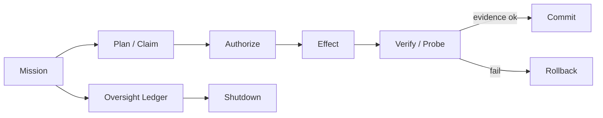

# AI Time Run

> Evidence-verified, event-sourced runtime for long-horizon autonomous agents.

AI Time Run 是一个面向长周期自主智能体的运行时。它把 OpenAI 与 Anthropic 的
四篇核心论文统一成一条可审计、可授权、可恢复的执行链，核心是
**State-Evidence-Authority-Coordination（状态-证据-权限-协同）**。

## 技术突破

现有智能体运行时大多把“模型循环、权限、校验”分开实现。AI Time Run 的突破点是
把它们收拢到**一条追加式事实账本**上：每一次状态变化都是一条带类型、带因果、带证据的事件，
于是长周期工作天然具备可回放、可审计、可证明的能力。

三条机制性不变量：

- `NO_PASS_WITHOUT_VERIFICATION`：功能没有经过探测证据，不能被标为通过。
- `NO_EFFECT_WITHOUT_AUTHORITY`：没有能力授权，不允许发起副作用。
- `NO_CLAIM_WITHOUT_EVIDENCE`：模型输出只是主张，只有被观察证据支持后才可信。

这三条不是靠提示词约束，而是靠日志级校验器 `validateLedger` 强制检查，任何伪造的
“通过”或“已验证”事件都会被拒绝。

## 四篇论文

| 论文 | 作者 | 吸收的机制 |
| --- | --- | --- |
| Building Effective Agents | Anthropic | 环境反馈闭环、简单优先、ACI/工具设计 |
| Effective Harnesses for Long-Running Agents | Anthropic | initializer/coding 分工、默认失败功能清单、增量推进、E2E 验证 |
| Practices for Governing Agentic AI Systems | OpenAI | 可问责、行动账本、审批门、能力边界、可逆、停机 |
| A Practical Guide to Building Agents | OpenAI | 单/多智能体编排、管理/去中心化、监督与评测 |

详见 [docs/01-papers.md](docs/01-papers.md) 与 [docs/02-architecture.md](docs/02-architecture.md)。

## 工作流

`Mission -> Plan(Claim) -> Authorize -> Effect -> Verify -> Commit`，外加
`Rollback`、`Shutdown`、`Oversight` 三组控制面。



## 快速开始

```bash
npm install
npm run build
npm run demo
npm test
```

`demo` 会跑四个功能，分别演示：授权成功、审批门放行、越权拒绝、审批拒绝。

## 项目结构

| 路径 | 职责 |
| --- | --- |
| `src/ledger.ts` | 追加式事件账本 |
| `src/project.ts` | 从事件重建当前状态 |
| `src/authority.ts` | 能力授权与审批门 |
| `src/evidence.ts` | 主张与证据 |
| `src/verification.ts` | 探测与校验 |
| `src/memory.ts` | 进度日志、工件存储 |
| `src/invariants.ts` | 日志级不变量校验 |
| `src/runtime.ts` | 编排器与运行时循环 |
| `src/demo.ts` | 自包含演示场景 |
| `tests/` | 不变量与回路测试 |
