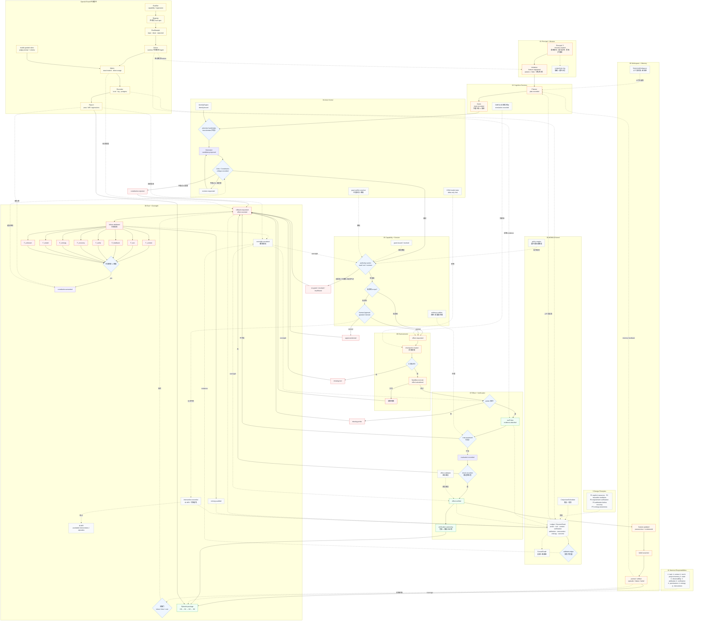
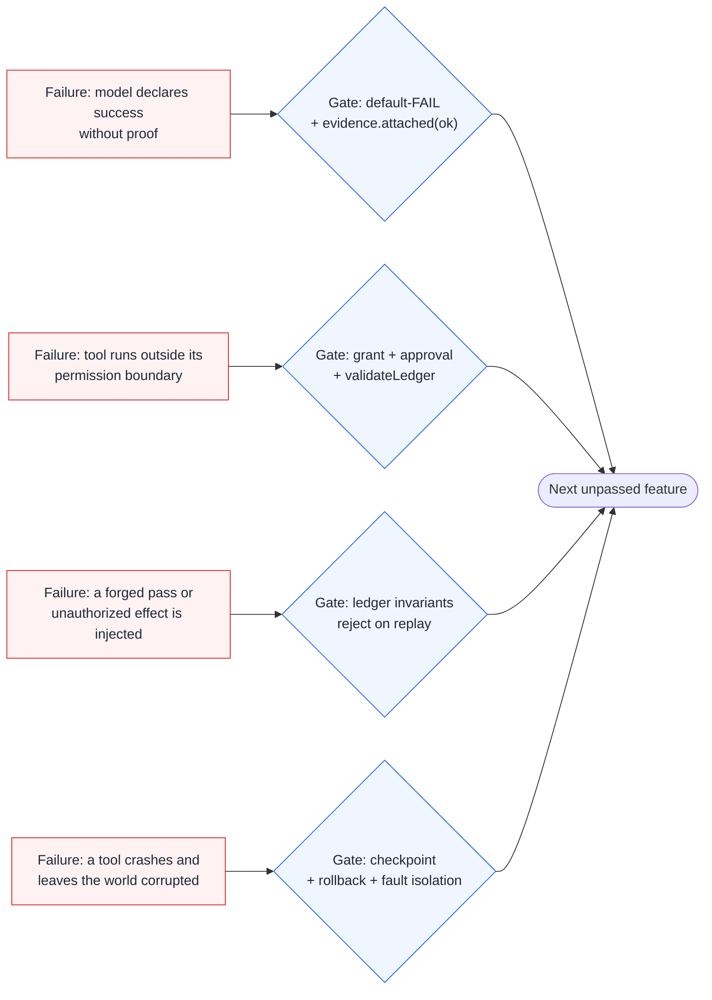

# ⏱️ AI Time Run

> **Autonomous agents need a ledger they cannot lie in.**

A managed-agent runtime that decouples the brain from the hands and turns every
run into an auditable, event-sourced Episode. Built from the MDIBUS V18
architecture and the 2026 Harness-Engineering papers.

[](package.json)
[](https://opensource.org/licenses/MIT)
[](https://www.typescriptlang.org/)
[](tests/runtime.test.mjs)
[](https://github.com/MAGA2010/AI-time-run)

---

## The problem

Long-horizon agents do not fail because the model is weak. They fail because
the runtime around the model is missing.

- 4 hours in, the agent has forgotten what it already verified and does it again.
- The agent declares "done" while the feature is still broken.
- A tool call runs outside its permission boundary and nobody notices.
- After a failure, you cannot tell whether the model, the tool, or the harness
  was at fault.
- A reviewer cannot reconstruct what actually happened from the conversation.

**AI Time Run does not make the model smarter.** It makes the model's work
auditable, verifiable, and reversible — by putting every step on a single
append-only ledger and refusing to trust the model's own word.

---

## How it works

Nine modules, one data flow. A run moves from intent to environment and back,
with human oversight able to intervene anywhere:

```text
01 Principal + Mission
        │
        ▼
02 Cognitive Services ── (plan → simulate → observe)
        │
        ▼
03 MDIBUS Kernel ────── (claim → evidence → causal history)
        │
        ▼
04 Actor Kernel ─────── (identity → lanes → dispatch)
        │
        ▼
05 Capability + Session (trust gateway → authority → isolation)
        │
        ▼
06 Environments / World (filesystem · shell · browser)
        │
        ▼
07 Effect + Verification (checkpoint → actualize → probe → verify)
        │
        ▼
08 Workspace + Memory ── (journal · artifacts · beliefs)
        ▲
        │ evidence / memory feedback
        └────────────────────────────────── 09 Eval + Oversight
```

| Module | Responsibility | Core artifact |
| --- | --- | --- |
| 01 Principal + Mission | Human intent, capability boundary, protected intentions | `mission.created` |
| 02 Cognitive Services | Planning, counterfactual simulation, observation | `plan.recorded`, `simulation.recorded` |
| 03 MDIBUS Kernel | Event-sourced durable semantics, claim vs evidence | `claim.recorded`, `evidence.attached` |
| 04 Actor Kernel | Identity binding, multi-agent lanes, dispatch | `identity.bound` |
| 05 Capability + Session | Semantic trust, authority, fault isolation | `grant.issued`, `approval.granted` |
| 06 Environments | Real filesystem / shell / browser adapters | `FileSystemAdapter` |
| 07 Effect + Verification | Checkpoint, actualize, probe, verify | `effect.verified` |
| 08 Workspace + Memory | Journal, artifacts, failure/episodic memory, beliefs | `ProgressJournal`, `BeliefRouter` |
| 09 Eval + Oversight | Metrics, blind spots, automatic escalation | `oversight.escalated` |

---

## Runtime workflow

The nine modules and the evidence-verified loop are one workflow: modules are
the stages, the loop is the path a feature takes through them, and every step
writes to the shared event ledger.



### Failure modes to harness gates

Each known long-running-agent failure mode is stopped by a specific gate:



---

## V18 primitives mapped to AI Time Run

| MDIBUS module | AI Time Run implementation | Status |
| --- | --- | --- |
| 01 Principal + Mission | `Mission` (protectedIntentions, capabilityBoundary), `AuthorityEngine` grant log | implemented |
| 02 Cognitive Services | `Simulator` (counterfactual), `Planner`, `ObserverBridge`, `Sandbox` | implemented |
| 03 MDIBUS Kernel | `Ledger + project`, `CausalGraph`, `Claim/Evidence/Belief`, `ConjectureScheduler` | implemented |
| 04 Actor Kernel | `Planner/Generator/Critic/Evaluator`, `IdentityEngine` | partial |
| 05 Capability + Session | `TrustGateway`, `AuthorityEngine`, `Sandbox` fault isolation | implemented |
| 06 Environments | `FileSystemAdapter`, `Sandbox` tools | partial |
| 07 Effect + Verification | `checkpoint -> actualized -> probe -> verified/reverted` | implemented |
| 08 Workspace + Memory | `ProgressJournal`, `ArtifactStore`, `EpisodicMemory`, `FailureMemory`, `BeliefRouter`, `SelectiveWorkspace` | implemented |
| 09 Eval + Oversight | `Oversight` (metrics + blindSpots + escalate), approval gates | implemented |

---

## Harness papers mapped

| Paper | Core mechanism | Landing point here |
| --- | --- | --- |
| AI Harness Engineering (2605.13357) | 11 responsibilities, H0-H3 ladder, eight failure classes, Episode package | `episode.ts`, `failure.attributed`, `entropy.audited`, `intervention.recorded` |
| Life-Harness (2605.22166) | Improve frozen models by evolving the runtime interface | `FailureMemory` → reusable constitution principles (roadmap) |
| SafeHarness (2604.13630) | Four defense layers + cross-layer escalation | `authority.ts`, `oversight.escalate()` |
| Effective harnesses for long-running agents | Initializer/Coding split, default-FAIL features | `feature.registered` default `passes:false` |
| Scaling Managed Agents | Session / Harness / Sandbox / Orchestration decoupling | `ledger` + `orchestrator` + `sandbox` + `authority` |
| Constitutional AI | Model self-critique / revision loop | `constitution.ts` Critic → revision |

---

## Runtime command map

| Command | What it does | Artifact |
| --- | --- | --- |
| `ai-time-run demo` | Run the managed-agent demo | `ledger.jsonl` |
| `ai-time-run demo --store ./data` | Run and persist state | `data/ledger.jsonl` |
| `ai-time-run episode` | Print the Episode audit package | JSON |
| `ai-time-run trace --store ./data` | Render a self-contained trace viewer | `data/trace.html` |
| `ai-time-run tamper --store ./data` | Inject forged events to show rejection | `forged-ledger.jsonl`, `forged-trace.html` |

| Role | Responsibility | Must not do |
| --- | --- | --- |
| Principal | Define intent, boundary, approvals, shutdown | Rewrite protected intentions |
| Initializer | Register default-failing features, init environment | Mark anything passing |
| Planner | Pick a feature, decompose steps, write plan + claim | Claim truth without evidence |
| Generator | Produce candidates, request effects | Approve its own work |
| Critic | Review candidates against the constitution | Pass a violating candidate |
| Evaluator | Run probes, attach evidence, verify effects | Pass without `ok:true` evidence |
| Observer | Assess trust, detect blind spots, escalate | Mutate trust from untrusted content |

```bash
# One complete evidence-verified loop
ai-time-run demo --store ./data
ai-time-run episode --store ./data
ai-time-run trace --store ./data
ai-time-run tamper --store ./data
```

---

## 30-second quickstart

```bash
git clone https://github.com/MAGA2010/AI-time-run
cd ai-time-run
npm install
npm run build
npm test

# Run the demo (memory only)
npm run demo

# Run the demo and persist the ledger
node dist/cli.js demo --store ./data

# Inspect the Episode audit package
node dist/cli.js episode --store ./data

# Render a self-contained trace viewer (open data/trace.html in a browser)
node dist/cli.js trace --store ./data

# Show that forged events are rejected by the invariant layer
node dist/cli.js tamper --store ./data
```

The demo runs four features and demonstrates authorized pass, approval gate,
no-capability rejection, approval denial, and one constitutional revision. The
expected output includes `57 events, VALID`, `harness level: H2`, and
`responsibilities: 10/11 covered`.

---

## The design rules (non-negotiable)

1. **Evidence before pass.** A feature can only flip to `passes: true` with an
   `ok: true` evidence event; the model's word is never trusted.
2. **Authority is data.** Grants are events; revocation is a tombstone; nothing
   acts without an active `act`-level grant.
3. **Every step is traceable.** The ledger is append-only and replayable; the
   invariant layer can reject forged events without trusting the writer.
4. **The brain is swappable.** `Reasoner` is the only model-facing seam; the
   harness and sandbox are model-agnostic.
5. **Failures are attributed, then recovered.** A failure gets a classified
   `failure.attributed` event before any rollback.
6. **The hands are isolated.** Tool crashes never reach the brain; effects are
   checkpointed before they run.

---

## Documentation

Full docs live under [docs/](docs/):

- [01-papers.md](docs/01-papers.md) — Anthropic / OpenAI engineering sources
- [02-architecture.md](docs/02-architecture.md) — early architecture notes
- [03-managed-agent-runtime.md](docs/03-managed-agent-runtime.md) — four components + multi-agent loop
- [04-workflow-diagram.md](docs/04-workflow-diagram.md) — full workflow, component, sequence diagrams
- [05-mdibus-mapping.md](docs/05-mdibus-mapping.md) — MDIBUS nine-module mapping
- [06-mdibus-blueprint.md](docs/06-mdibus-blueprint.md) — MDIBUS V18 full blueprint
- [07-harness-papers.md](docs/07-harness-papers.md) — three 2026 arXiv papers deep-dive
- [08-v18-deep-study.md](docs/08-v18-deep-study.md) — complete V18 study notes
- [09-harness-merge.md](docs/09-harness-merge.md) — DeepSeek × ChatGPT/Codex harness merge
- [10-openai-evals.md](docs/10-openai-evals.md) — OpenAI Evals mapped into the runtime

---

## Contributing

Bug fixes, docs improvements, and new harness modules are welcome. The
[design rules](#the-design-rules-non-negotiable) above are the source of truth
for any change. Keep a new module testable and wired into the Episode package.

---

## License

[MIT](LICENSE) — © 2026 MAGA2010

---

## Star history

<a href="https://star-history.com/#MAGA2010/AI-time-run&Date">
  <picture>
    <source media="(prefers-color-scheme: dark)" srcset="https://api.star-history.com/svg?repos=MAGA2010/AI-time-run&type=Date&theme=dark" />
    <source media="(prefers-color-scheme: light)" srcset="https://api.star-history.com/svg?repos=MAGA2010/AI-time-run&type=Date" />
    
  </picture>
</a>
