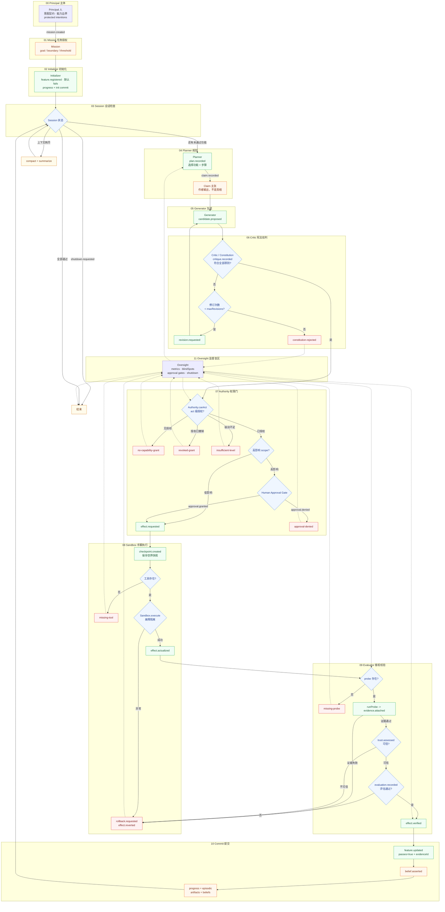

# AI Time Run

> Managed Agent Runtime: decouple the brain from the hands, and make every
> step auditable through a single event-sourced Session.

AI Time Run 是一个面向长周期自主智能体的运行时，吸收 Anthropic 的 Harness 工程
源头，把 `Planner - Generator - Evaluator - Critic` 多智能体对抗闭环、大脑/手脚
解耦、宪法对齐和事件溯源统一到一条追加式事实账本上。

## 技术突破

现有的 Agent 运行时大多把“模型循环、工具执行、权限、校验”分开实现。AI Time Run
的突破点是把它们收拢到四个可独立部署的组件，并用一条 Session 账本贯穿：

- `Session`：追加式事件账本，独立于模型上下文窗口，可重放、切片、回退。
- `Harness`：编排中枢，运行 Planner-Generator-Evaluator-Critic 对抗闭环。
- `Sandbox`：手脚工具执行，故障隔离、能力边界、快照回滚，与大脑彻底解耦。
- `Orchestration`：任务分解、权限门、审批门、效应校验与信念路由。

三条机制性不变量：

- `NO_PASS_WITHOUT_VERIFICATION`：功能没有探测证据，不能被标为通过。
- `NO_EFFECT_WITHOUT_AUTHORITY`：没有能力授权，不允许发起副作用。
- `NO_CLAIM_WITHOUT_EVIDENCE`：模型输出只是主张，只有被观察证据支持后才可信。

这些不变量由 `validateLedger` 强制检查，任何伪造的“通过”或“已验证”事件都会被拒绝。

## MDIBUS 血缘

本实现以 `MDIBUS-Runtime Architecture V18` 的九模块为蓝本，保留
`State-Evidence-Authority-Coordination` 范式，并在三处做了创新：

- 反事实模拟认知层：先模拟、后执行，副作用在真实世界中隔离。
- 因果历史与隔离图：把 `atomic/parallel` 与依赖关系变成可审计的事实。
- 语义信任网关：不可信内容不能改变信任，只有可信证据才能翻转状态。

完整九模块映射见 [docs/05-mdibus-mapping.md](docs/05-mdibus-mapping.md)。

## 四篇核心论文

| 论文 | 作者 | 吸收的机制 |
| --- | --- | --- |
| Effective harnesses for long-running agents | Anthropic 2025-11 | Initializer/Coding 分工、默认失败功能清单、跨会话持久工件 |
| Harness design for long-running application development | Anthropic 2026-03 | Planner-Generator-Evaluator 对抗 Harness、sprint 迭代 |
| Scaling Managed Agents: Decoupling the brain from the hands | Anthropic 2026-04 | Session/Harness/Sandbox/Orchestration 四组件、大脑手脚解耦 |
| Constitutional AI: Harmlessness from AI Feedback | Anthropic 2022 | 模型自我批判-修正闭环，嵌入证据-校验层 |

完整论文合集与补充技术博客见 [docs/01-papers.md](docs/01-papers.md)，架构细节见
[docs/03-managed-agent-runtime.md](docs/03-managed-agent-runtime.md)。

## 工作流



四组件架构图与多智能体握手时序图见
[docs/04-workflow-diagram.md](docs/04-workflow-diagram.md)。

## 快速开始

```bash
npm install
npm run build
npm run demo
npm test
```

`demo` 会跑四个功能，分别演示：授权成功、审批门放行、越权拒绝、审批拒绝，并触发一次
宪法修订环。

## 项目结构

| 路径 | 职责 |
| --- | --- |
| `src/ledger.ts` | 追加式事件账本 |
| `src/project.ts` | 从事件重建当前状态 |
| `src/session.ts` | 会话重放、切片、摘要 |
| `src/sandbox.ts` | 手脚工具执行与故障隔离 |
| `src/constitution.ts` | 宪法原则与批判 |
| `src/actors.ts` | 角色与可插拔 Reasoner |
| `src/authority.ts` | 能力授权与审批门 |
| `src/evidence.ts` | 主张与证据 |
| `src/verification.ts` | 探测与校验 |
| `src/memory.ts` | 进度、情景、失败、信念路由 |
| `src/oversight.ts` | 指标与盲区检测 |
| `src/invariants.ts` | 日志级不变量校验 |
| `src/orchestrator.ts` | ManagedRuntime 编排器 |
| `src/demo.ts` | 自包含演示场景 |
| `tests/` | 不变量与回路测试 |
