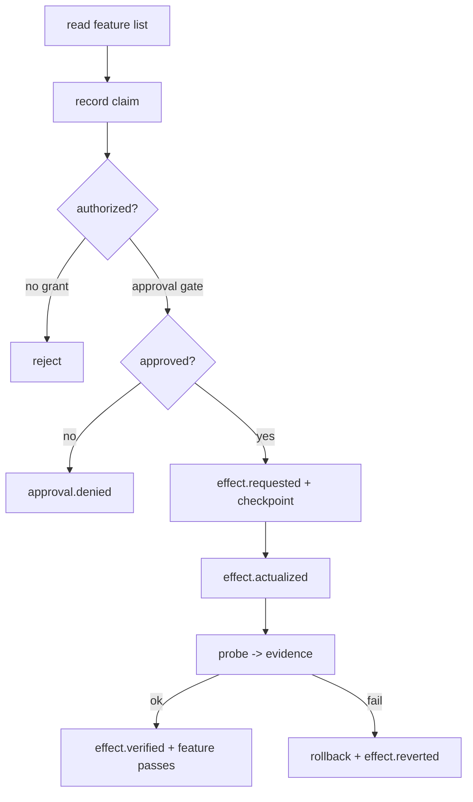

# 架构与突破点

## 定位

AI Time Run 是**证据验证的事件溯源智能体运行时**（Evidence-verified,
Event-sourced Agent Runtime）。它解决一个具体问题：长周期 Agent 在多个上下文窗口
之间工作时，如何证明“谁、在什么证据、什么权限下、产生了什么效应”。

## 核心范式

- `State`：当前状态是事件日志的投影，永远可以从日志重建。
- `Evidence`：模型输出先记为 `Claim`，被探测支持后成为 `Evidence`。
- `Authority`：权限是可强制执行的授权事件，可被墓碑撤销。
- `Coordination`：多个具名角色通过车道、身份与因果链协同。

## 事件类型

所有事件都追加到 `Ledger`，每条事件含 `id / seq / at / type / actor / payload / parent / evidence`。

| 事件 | 含义 |
| --- | --- |
| `mission.created` | 主体意图契约与能力边界 |
| `feature.registered` | 默认失败的测试契约 |
| `grant.issued` / `grant.revoked` | 能力授权与撤销 |
| `approval.granted` / `approval.denied` | 人工审批门 |
| `claim.recorded` | 模型主张（不是真相） |
| `evidence.attached` | 探测/观察证据 |
| `effect.requested` / `actualized` / `verified` / `reverted` | 副作用生命周期 |
| `checkpoint.created` / `rollback.requested` | 可逆性 |
| `feature.updated` | 只有带证据才能翻转 |
| `shutdown.requested` | 停机 |

## 运行时循环

## 不变量

`validateLedger` 在日志层面强制三条机制性不变量，并把伪造事件判定为违规：

1. 功能翻转 `passes: true` 必须引用 `ok: true` 的证据事件。
2. `effect.verified` 必须引用 `ok: true` 的证据事件。
3. `effect.requested` 必须存在对应的、未撤销的 `act` 级授权。

此外还检查序号连续（追加完整性）与因果父链（`effect.actualized` 必须指向
`effect.requested`）。

## 可逆与停机

- 可逆：执行副作用前写入 `checkpoint.created`，校验失败写 `rollback.requested` 并
  调用 handler 的 `revert`，最终写 `effect.reverted`。
- 停机：`shutdown.requested` 让 `runFeature` 立即拒绝，`runAll` 停止继续。

## 演进方向

- 把 `Ledger` 的磁盘保存从“全量快照”升级为真正的增量追加。
- 引入 `ActorKernel`，让 `manager` 与 `decentralized` 多智能体模式成为一等公民。
- 增加 `Belief-Router` 与墓碑，支持跨会话撤回旧结论。
- 加入 `Monitor-Blind-Spot` 指标，让监督层同时监督 Agent 和 Agent 的监控器。

完整流程大图、组件架构图和多智能体时序图见 [04-workflow-diagram.md](04-workflow-diagram.md)。
