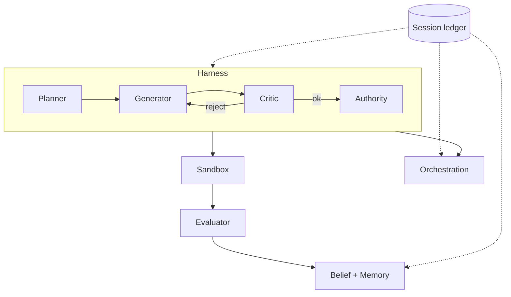

# Managed Agent Runtime 架构

## 定位

AI Time Run 是一个“大脑与手脚解耦”的 Managed Agent Runtime。它的目标不是让模型
更聪明，而是让长周期自主智能体在多个上下文窗口之间保持可审计、可授权、可恢复。

## 四大组件



- `Session`：追加式事件账本，状态可重放、可切片、可回退。
- `Harness`：编排中枢，运行多智能体对抗闭环。
- `Sandbox`：手脚工具执行，故障隔离、能力边界、快照恢复。
- `Orchestration`：调度、权限、审批、监督与信念路由。

## 多智能体对抗闭环

`Planner -> Generator -> Critic -> Evaluator`：

1. `Planner`：读取任务与功能清单，产出 `Plan` 和 `Claim`。
2. `Generator`：产出候选实现 `Candidate`。
3. `Critic`：按 `Constitution` 原则批判候选，不符合则请求修订，直至符合或达到上限。
4. `Authority`：能力授权与高影响审批门。
5. `Sandbox`：在隔离环境中执行副作用，写入检查点。
6. `Evaluator`：用 `Probe` 采集外部环境证据，做客观评估。
7. `Commit / Rollback`：证据与评估通过才提交，否则回滚。
8. `Belief`：通过验证的功能写入信念，可被墓碑撤回。

## 事件模型

每条事件含 `id / seq / at / type / actor / payload / parent / evidence`。关键事件：

| 事件 | 含义 |
| --- | --- |
| `mission.created` | 主体意图与能力边界 |
| `feature.registered` | 默认失败的测试契约 |
| `plan.recorded` | 规划者产出的计划 |
| `claim.recorded` | 规划者主张 |
| `candidate.proposed` | 生成器候选 |
| `critique.recorded` | 批判者审查 |
| `revision.requested` | 宪法修订请求 |
| `effect.requested/actualized/verified/reverted` | 副作用生命周期 |
| `evidence.attached` | 探测证据 |
| `evaluation.recorded` | 评估者结论 |
| `belief.asserted/retracted` | 信念与墓碑 |
| `shutdown.requested` | 停机 |

## 不变量

`validateLedger` 强制三条机制性不变量，并拒绝伪造事件：

1. 功能翻转 `passes: true` 必须引用 `ok: true` 的证据。
2. `effect.verified` 必须引用 `ok: true` 的证据。
3. `effect.requested` 必须存在未撤销的 `act` 级授权。

同时检查序号连续（追加完整性）与因果父链。

## 可插拔大脑

`Reasoner` 是唯一需要接入 LLM 的接口，其余组件都是模型无关的：

```ts
interface Reasoner {
  plan(mission, features, context): Promise<Plan> | Plan;
  generate(plan, context): Promise<Candidate> | Candidate;
  critique(candidate, principles, context): Promise<Critique[]> | Critique[];
  evaluate(candidate, evidence, context): Promise<Evaluation> | Evaluation;
}
```

默认的 `DefaultReasoner` 提供确定性实现，方便测试；生产环境替换为真实模型即可。

## 监督盲区

`Oversight` 不仅监控 Agent，还监控监控器本身。任何通过但无法端到端追溯
（缺少计划、证据或批判）的功能都会作为 `blind spot` 上报。

完整的运行时主循环、四组件架构和多智能体握手时序见
[04-workflow-diagram.md](04-workflow-diagram.md)。
