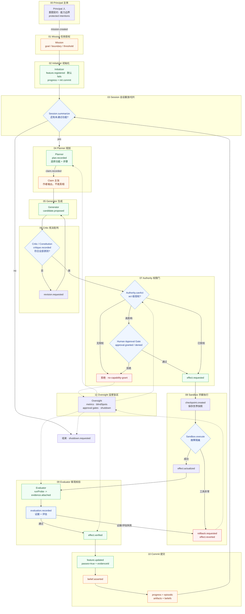
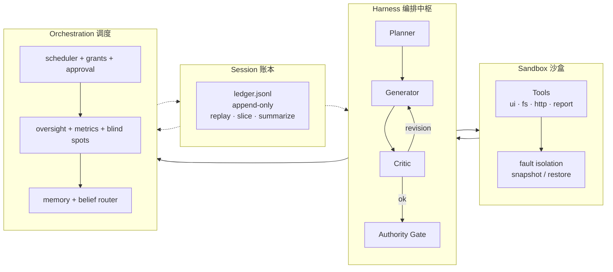
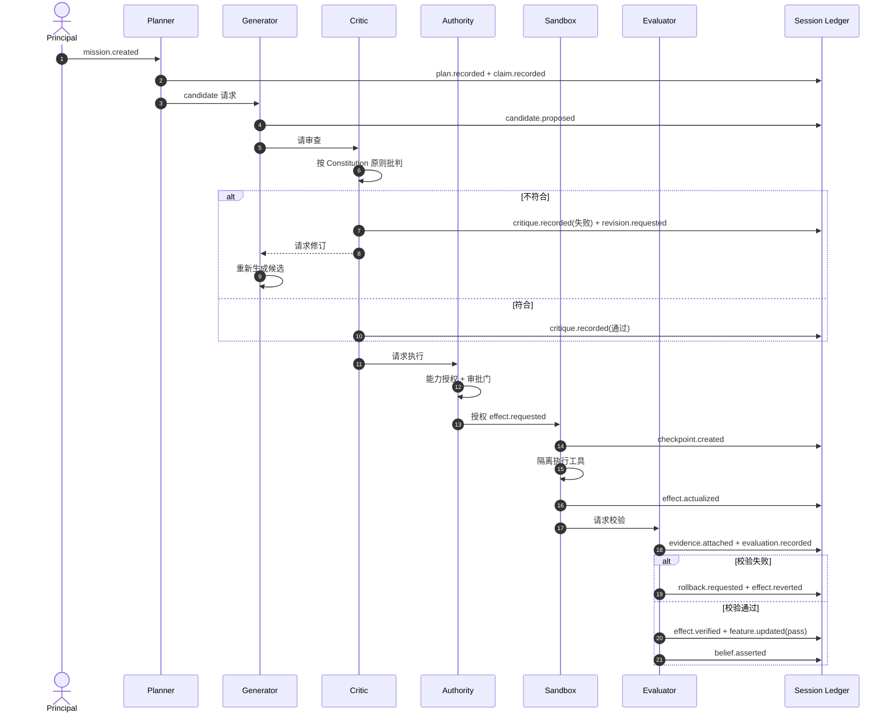

# 完整工作流大图

下面是 Managed Agent Runtime 的完整执行图。为了看清每个角色、每条事件和每个
回环，它有意画得比较重：实线是主链路，虚线是监督与反馈。

## 1. 运行时主循环

```mermaid
flowchart TB
  subgraph L0["00 Principal 主体"]
    P0["Principal 人<br/>意图契约 · 能力边界<br/>protected intentions"]
  end

  subgraph L1["01 Mission 任务授权"]
    P0 -->|"mission.created"| M1["Mission<br/>goal / boundary / threshold"]
  end

  subgraph L2["02 Initializer 初始化"]
    M1 --> I1["Initializer<br/>feature.registered · 默认 fails<br/>progress + init commit"]
  end

  subgraph L3["03 Session 会话重放/切片"]
    I1 --> S1{"Session.summarize<br/>还有未通过功能?"}
  end

  S1 -->|"no"| DONE["结束 · shutdown.requested"]
  S1 -->|"yes"| L4

  subgraph L4["04 Planner 规划"]
    PL1["Planner<br/>plan.recorded<br/>选择功能 + 步骤"]
    PL1 -->|"claim.recorded"| PL2["Claim 主张<br/>作者输出，不是真相"]
  end

  subgraph L5["05 Generator 生成"]
    PL2 --> G1["Generator<br/>candidate.proposed"]
  end

  subgraph L6["06 Critic 宪法批判"]
    G1 --> C1{"Critic / Constitution<br/>critique.recorded<br/>符合全部原则?"}
    C1 -->|"否"| RV["revision.requested"]
    RV --> G1
  end

  subgraph L7["07 Authority 权限门"]
    C1 -->|"是"| A1{"Authority.canAct<br/>act 级授权?"}
    A1 -->|"无授权"| DENY["拒绝 · no-capability-grant"]
    A1 -->|"高影响"| AP{"Human Approval Gate<br/>approval.granted / denied"}
    AP -->|"拒绝"| DENY
    AP -->|"通过"| EF
    A1 -->|"已授权"| EF
  end

  subgraph L8["08 Sandbox 手脚执行"]
    EF["effect.requested"] --> CK["checkpoint.created<br/>保存世界快照"]
    CK --> SB{"Sandbox.execute<br/>故障隔离"}
    SB -->|"工具异常"| RB["rollback.requested<br/>effect.reverted"]
    SB -->|"成功"| EA["effect.actualized"]
  end

  subgraph L9["09 Evaluator 客观校验"]
    EA --> PR["Evaluator<br/>runProbe -> evidence.attached"]
    PR --> EV["evaluation.recorded<br/>证据 + 评估"]
    EV -->|"证据/评估失败"| RB
    EV -->|"通过"| VF["effect.verified"]
  end

  subgraph L10["10 Commit 提交"]
    VF --> FU["feature.updated<br/>passes=true + evidenceId"]
    FU --> BL["belief.asserted"]
    BL --> MEM["progress + episodic<br/>artifacts + beliefs"]
  end

  MEM --> S1

  subgraph L11["11 Oversight 监督盲区"]
    OV["Oversight<br/>metrics · blindSpots<br/>approval gates · shutdown"]
  end

  OV -.-> PL1
  OV -.-> A1
  OV -.-> PR
  OV -.-> VF
  OV -.-> DONE
  DENY -.-> OV
  RB -.-> OV

  classDef state fill:#fff7ed,stroke:#ea580c,color:#7c2d12;
  classDef gate fill:#eff6ff,stroke:#2563eb,color:#1e3a8a;
  classDef write fill:#f0fdf4,stroke:#16a34a,color:#14532d;
  classDef fail fill:#fef2f2,stroke:#dc2626,color:#7f1d1d;
  class M1,PL2,MEM,BL state;
  class S1,C1,A1,AP,SB,EV gate;
  class I1,PL1,G1,EF,PR,VF,FU write;
  class DENY,RB fail;
```

## 2. 四组件架构

```mermaid
flowchart LR
  subgraph Session["Session 账本"]
    SG["ledger.jsonl<br/>append-only<br/>replay · slice · summarize"]
  end

  subgraph Harness["Harness 编排中枢"]
    HP["Planner"] --> HG["Generator"] --> HC["Critic"]
    HC -->|"revision"| HG
    HC -->|"ok"| HA["Authority Gate"]
  end

  subgraph Sandbox["Sandbox 沙盒"]
    ST["Tools<br/>ui · fs · http · report"]
    SF["fault isolation<br/>snapshot / restore"]
    ST --> SF
  end

  subgraph Orchestration["Orchestration 调度"]
    OD["scheduler + grants + approval"]
    OV2["oversight + metrics + blind spots"]
    OM["memory + belief router"]
    OD --> OV2 --> OM
  end

  Harness --> Sandbox
  Harness --> Orchestration
  Sandbox --> Harness
  Session -.-> Harness
  Session -.-> Orchestration
  Orchestration -.-> Session
```

## 3. 多智能体握手时序

```mermaid
sequenceDiagram
  autonumber
  actor Human as Principal
  participant P as Planner
  participant G as Generator
  participant C as Critic
  participant A as Authority
  participant S as Sandbox
  participant E as Evaluator
  participant L as Session Ledger

  Human->>P: mission.created
  P->>L: plan.recorded + claim.recorded
  P->>G: candidate 请求
  G->>L: candidate.proposed
  G->>C: 请审查
  C->>C: 按 Constitution 原则批判
  alt 不符合
    C->>L: critique.recorded(失败) + revision.requested
    C-->>G: 请求修订
    G->>G: 重新生成候选
  else 符合
    C->>L: critique.recorded(通过)
  end
  C->>A: 请求执行
  A->>A: 能力授权 + 审批门
  A->>S: 授权 effect.requested
  S->>L: checkpoint.created
  S->>S: 隔离执行工具
  S->>L: effect.actualized
  S->>E: 请求校验
  E->>L: evidence.attached + evaluation.recorded
  alt 校验失败
    E->>L: rollback.requested + effect.reverted
  else 校验通过
    E->>L: effect.verified + feature.updated(pass)
    E->>L: belief.asserted
  end
```
