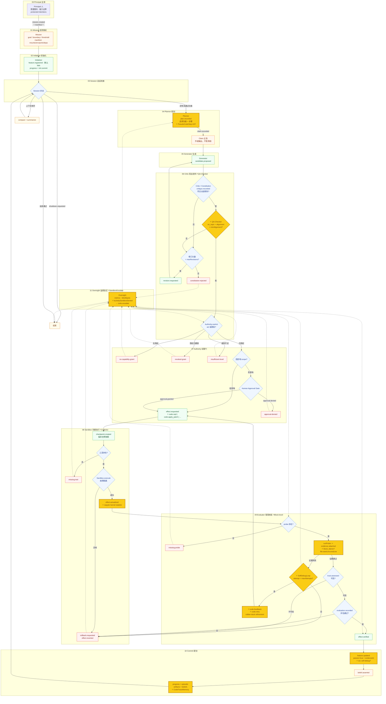
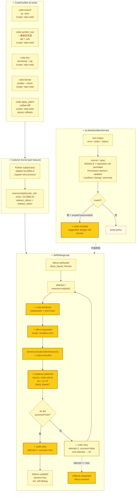
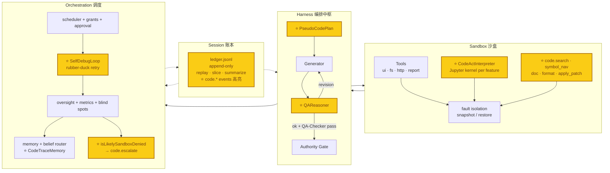
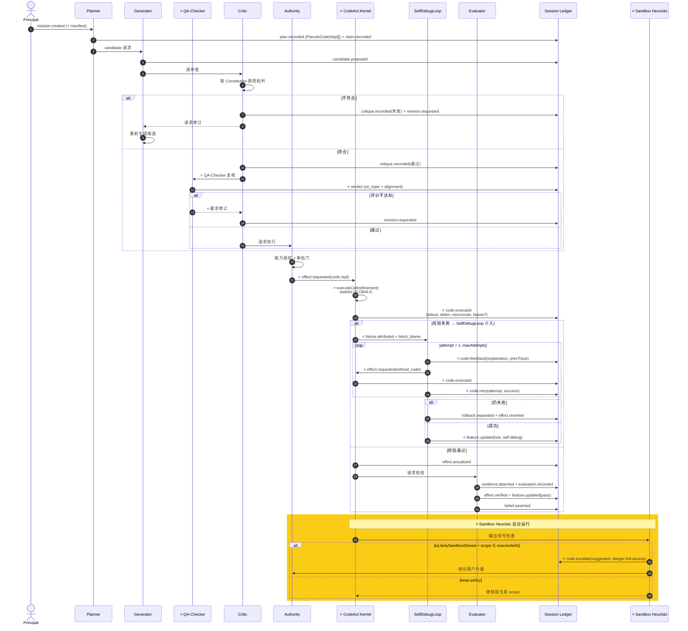

# 完整工作流大图（BREAK 7 升级版）

下面是 Managed Agent Runtime 的完整执行图。为了看清每个角色、每条事件和每
个回环，它有意画得比较重：实线是主链路，虚线是监督与反馈。

> **BREAK 7 标注**：图中标 **黄底（#facc15）** 的节点是 CodeAgent 集成
> 新增的环节（`code.*` 事件 / CodeAct kernel / SelfDebugLoop / QA-Checker
> / sandbox heuristic）。如果只看基础 managed-agent 路径，可忽略这些。

---

## 1. 运行时主循环（含 BREAK 7）

---

## 2. BREAK 7 CodeAgent 子回路（黄底高亮）

下面这张图专门画 BREAK 7 的核心创新——`code.repl` 的失败不再直接回滚，而是
进入 `SelfDebugLoop` 循环。每一轮都把 brain 的解释 / 修订 / 执行结果写到
ledger，让 reviewer 能完整还原 "模型说过什么 vs kernel 实际做了什么"。

---

## 3. 四组件架构（含 CodeAct 作为第六个 Environment）

---

## 4. 多智能体握手时序（含 SelfDebugLoop）

---

## 5. EventType 增量（黄底 = BREAK 7）

```mermaid
flowchart LR
  subgraph BASE["原 36 种 EventType"]
    direction TB
    B1["mission.created"]
    B2["claim.recorded"]
    B3["plan.recorded"]
    B4["candidate.proposed"]
    B5["critique.recorded"]
    B6["effect.intent"]
    B7["effect.requested"]
    B8["effect.actualized"]
    B9["evidence.attached"]
    B10["effect.verified"]
    B11["feature.updated"]
  end

  subgraph BREAK7["⭐ 新增 7 种 EventType（黄底）"]
    direction TB
    N1["code.executed<br/>REPL cell 完成"]
    N2["code.feedback<br/>rubber-duck 解释"]
    N3["code.retry<br/>attempt + success"]
    N4["code.symbol_resolved<br/>def 命中"]
    N5["code.apply_patch<br/>unified-diff 写入"]
    N6["code.plan_recorded<br/>PseudoCodeStep AST"]
    N7["code.escalate<br/>沙箱拒绝 → 询问升级"]
  end

  BASE --> BREAK7

  classDef break7 fill:#facc15,stroke:#a16207,color:#713f12,stroke-width:2px;
  class N1,N2,N3,N4,N5,N6,N7 break7;
```

---

## 6. 颜色图例（Color Legend）

| 颜色 | 含义 | CSS class |
| --- | --- | --- |
| 🟧 浅橙 | 状态/数据（State） | `state` fill:#fff7ed |
| 🟦 浅蓝 | 决策门（Gate） | `gate` fill:#eff6ff |
| 🟩 浅绿 | 写入/成功（Write） | `write` fill:#f0fdf4 |
| 🟥 浅红 | 失败/回滚（Fail） | `fail` fill:#fef2f2 |
| 🟨 **黄底** | **BREAK 7 新增**（CodeAgent） | **`break7` fill:#facc15** |
| 🟨 浅黄（kernel 子色） | Python 子进程状态 | `kernel` fill:#fef9c3 |
| 🟧 深黄（warn） | 收尾/警告 | `warn` fill:#fffbeb |

**黄底节点 = BREAK 7 创新**：
- `Planner` 输出 `PseudoCodeStep[]` AST（替代 NLP steps）
- `QA-Checker` 新 lane（EMNLP'24 CodeAgent）
- `effect.actualized` 走 Jupyter stateful kernel
- `evidence.attached` 携带 `block_blame`（LDB）
- `SelfDebugLoop` 替换 immediate rollback（ICLR'24）
- `feature.updated.via` = `'self-debug'` 标识
- `EpisodicMemory` 增加 `CodeTraceMemory` schema
- `Oversight` 跑 `isLikelySandboxDenied` → `code.escalate`
