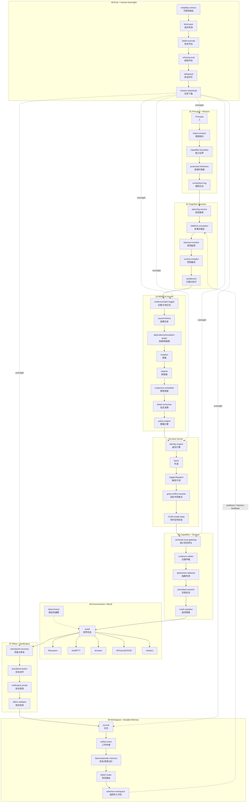

# MDIBUS V18 完整蓝图

下面按 MDIBUS-Runtime Architecture V18 的九大模块，把每个子组件都画出来。
`09 人机监督` 以虚线反向介入全链路，`08 持久记忆` 把结果回灌 `02 认知服务`。
每个模块不再是一个团簇，而是一条逻辑链：一个节点只承载一个概念，边就是工作流顺序。

## 与实现的对应

| 模块 | 已实现组件 | 预留 / 未来 |
| --- | --- | --- |
| 01 | `Mission`、`AuthorityEngine` 授权日志 | 人机意图契约的显式 UI |
| 02 | `Simulator`(OMEGA)、`Planner`、`ObserverBridge`、`Sandbox` | Control Compiler |
| 03 | `Ledger`、`CausalGraph`、`Claim/Evidence/Belief`、`ConjectureScheduler`、`AuthorityEngine` | Retainer 策略引擎 |
| 04 | `Planner/Generator/Critic/Evaluator`、`IdentityEngine` | Goal Conflict Resolver、External-Agent-Adapter、COW Model State |
| 05 | `TrustGateway`、`Sandbox`、故障隔离 | Precedent-Session、Abstraction Detector、Evidence Arbiter |
| 06 | `Sandbox` 工具、`FileSystemAdapter`（真实文件系统） | Browser/Shell/API/Determinism 适配器 |
| 07 | `checkpoint -> probe -> verified/reverted` | Effect-Validator 差异断言 |
| 08 | `ProgressJournal`、`ArtifactStore`、`EpisodicMemory`、`FailureMemory`、`BeliefRouter`、`SelectiveWorkspace` | — |
| 09 | `Oversight`、审批门、停机、`escalate()` 自动升级 | Belief-Eval-Lab、Refusing-Evaluation、Mission-Download |
