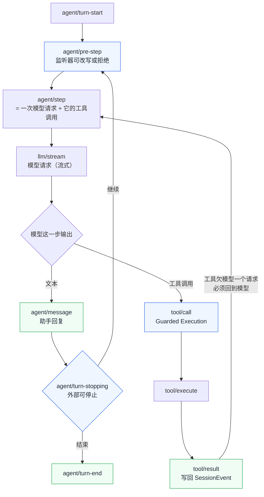
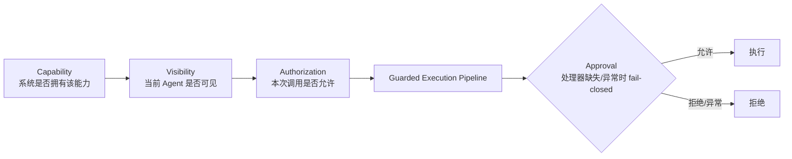
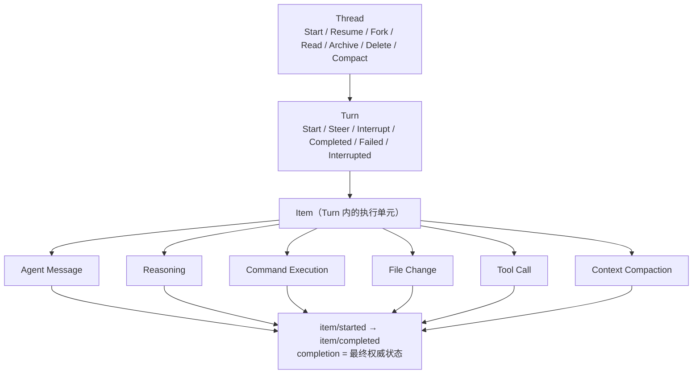
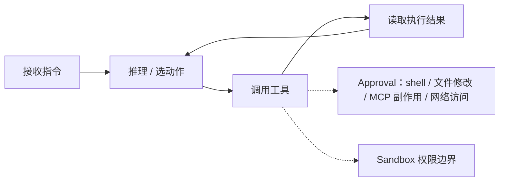
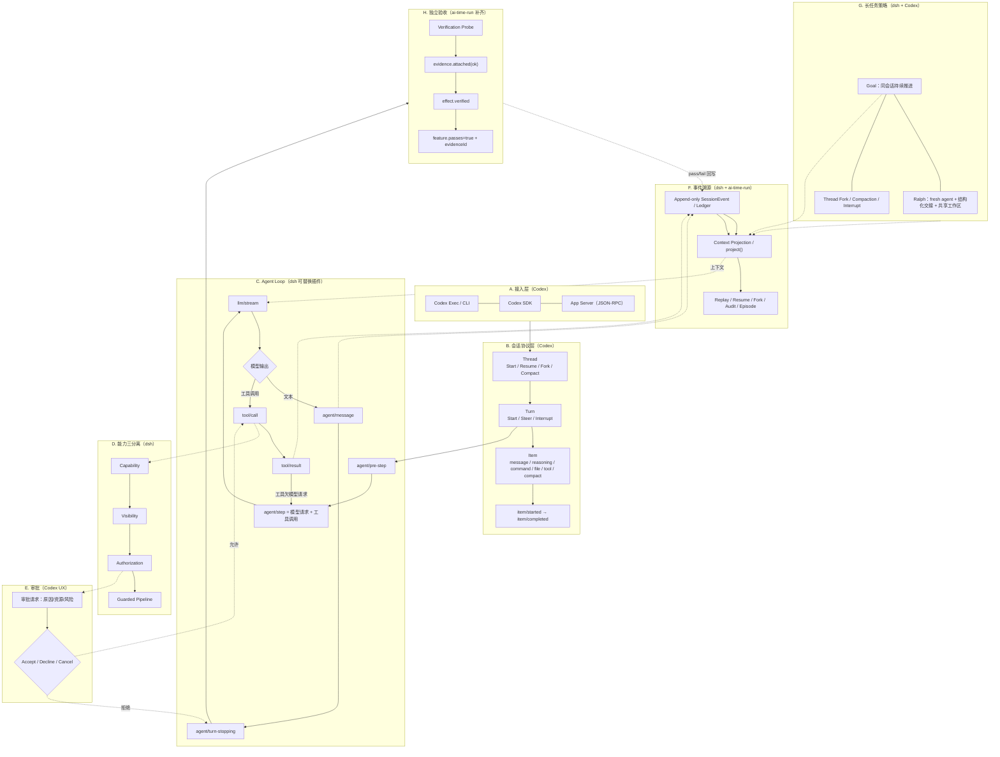

# DeepSeek Harness × ChatGPT/Codex Harness 合并工作流（详细版）

这份笔记把两套 Agent Runtime 的工作流逐层拆开，再合成一张可以落进 `ai-time-run`
的完整流程图。目标不是选边站，而是把两边真正强的东西拼成一条流水线。

## 1. DeepSeek Harness（dsh）逐层拆解

### 1.1 插件微内核（Cordis）

`dsh` 的宣言是 Everything is a plugin。下面这些“核心组件”全部是插件，没有特权内核：

| 插件 | 职责 |
| --- | --- |
| `dsh-llm` | 模型适配器接缝；再拆 `dsh-llm-deepseek`、`dsh-llm-pi-ai`、`dsh-llm-retry` |
| `dsh-tools` | 工具注册表；再拆 bash / file / web / subagent / edit |
| `dsh-session` | 会话；再拆 persistence / query / projection / telemetry / checkpoint |
| `dsh-agent-loop` | 主循环本身，可替换 |
| `dsh-sandbox-policy` | 沙箱策略 |
| `dsh-user-approval` | 审批策略 |
| `dsh-permission-presets` | 权限预置 |
| `dsh-fs-observation-policy` | 文件“先读后改”策略 |

运行时的最终配置由 `Profile + Bundle + Patch` 三棵树叠出来（`--dump-config` 可见）。
插件能注册 Service、Typed Event、可撤销 Effect，卸载时必须能回收干净。

### 1.2 会话事件溯源

- 会话状态是**追加式 `SessionEvent` 日志**，是唯一事实源。
- 模型消息历史不单独存，而是从日志**投影（Context Projection）**出来。
- 约束：**Model-visible means logged**——凡进入模型的，必须能从日志重建。
- Replay / Resume / Fork / Telemetry / Audit 都是对同一批事件的重新投影。

### 1.3 主循环：Turn / Step 事件切面

关键：**一个 step 是“一次模型请求 + 它触发的工具调用”**；工具执行完“欠模型一个请求”，
必须回到模型再决定下一步，工具不会自己继续跑。

### 1.4 能力三分离 + 审批 fail-closed

注意：注册了工具 ≠ 所有 Agent 都能调用；同一个工具在不同 session 的可见性可以不同。

### 1.5 长任务策略

| 策略 | 机制 |
| --- | --- |
| Goal | 同一 Session 保存目标状态，靠后续 Round 持续推进 |
| Ralph | 每轮启动全新子 Agent，只继承“不可变目标 + 轮次 + 共享工作区 + 结构化交接报告”，主动丢弃失败尝试和过时推理 |
| Workflow | 声明式步骤编排 |
| Subagent | 委派子 Agent |
| Jobs | 后台任务 |

### 1.6 沙箱三档

`read-only` / `workspace-write` / `danger-full-access`。当前主要约束文件系统，
网络与进程隔离不保证，仍需外部补 IAM / 凭证 / 网关。

## 2. ChatGPT / OpenAI Codex Harness 逐层拆解

### 2.1 状态协议：Thread → Turn → Item

### 2.2 Agent Loop（复用的核心）

### 2.3 集成层

| 入口 | 适用场景 |
| --- | --- |
| Codex Exec | 一次性脚本、CI/CD、后台批处理 |
| Codex SDK（TS / Python） | 应用内启动 / 继续 / 恢复 Thread |
| Codex App Server | 双向 JSON-RPC，完整生命周期：创建 Thread、启动 Turn、收事件、处理中断、响应审批 |

### 2.4 长任务

持久 Thread、Goal + Token Budget、Resume、Fork、Compaction、Interrupt，
有 `tokensUsed / timeUsedSeconds` 计量。但 `turn/completed` 是运行时状态，
**不等于业务验收通过**。

## 3. 合并后的完整工作流（大图）

## 4. 合并工作流 → ai-time-run 映射

| 合并工作流节点 | ai-time-run 落点 |
| --- | --- |
| Thread / Turn / Item | 待实现：`Thread / Turn / Item` 生命周期协议 |
| agent/pre-step | `orchestrator.runFeature` 前置校验（shutdown / 已通过 / binding） |
| agent/step | `plan → generate → critique → authority → execute → probe` |
| 模型请求 llm/stream | `Reasoner.plan/generate/critique/evaluate` |
| tool/call → tool/result | `Sandbox.execute` → `effect.actualized` |
| 工具欠模型请求 | `runFeature` 每功能单步推进，不自续 |
| Capability → Visibility → Authorization | `AuthorityEngine.canAct`（grant 分级 + approval gate） |
| Guarded Pipeline + fail-closed | `Sandbox` 故障隔离 + `validateLedger` 不变量 |
| Approval Accept/Decline/Cancel | `approval.granted / approval.denied` |
| SessionEvent append-only | `Ledger`（`ledger.jsonl`） |
| Context Projection | `project()` |
| Replay / Resume / Audit | `session.replay / slice / summarize` + `episode.buildEpisode` |
| Goal / Ralph | 待实现：Goal 已有 `Mission`，Ralph 待加 |
| Verification Probe | `runProbe → evidence.attached` |
| 独立验收 | `effect.verified → feature.updated(passes=true)` |
| 监督升级 | `oversight.escalate()` |
| 身份绑定 | `IdentityEngine`（`identity.bound`） |
| 确定性检查（突破 2） | `check.recorded`（fresh-context verifier，独立于 generator 自述） |
| 自进化（突破 3） | `constitution.amended`（失败归因重复 ≥ 阈值 → 自动追加原则） |

## 5. 结论

两条路线的本质差异是：

- DeepSeek 给“重新定义 Runtime”的自由（插件化 + 事件溯源 + 能力三分离 + Goal/Ralph）。
- Codex 给“快速嵌入产品”的成熟协议（Thread/Turn/Item + Exec/SDK/AppServer + 审批 UX）。

合并后是一条可落地的流水线：**产品协议进、插件循环跑、三分离约束、事件溯源记录、
长任务策略接力、独立验证收口**。我们目前已经覆盖 F/H（事件溯源 + 独立验收）和
D/E 的大部分，缺的是 B（Thread/Turn/Item）和 G 里的 Ralph。
