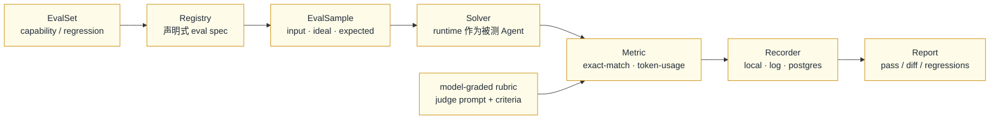

# OpenAI Evals 开源框架 → ai-time-run 映射

OpenAI Evals 解决的既不是“模型怎么写”，也不是“沙箱怎么隔离”，而是
**如何在不碰生产 Runtime 的前提下，反复、可复现地回答：这个 Agent 到底行不行**。
它把“评测”从模型训练阶段拉出来，变成一个独立的、声明式的、可记录的外部闭环。

## 1. 核心组件

| 组件 | OpenAI Evals 里的职责 | 我们放进流程图的位置 |
| --- | --- | --- |
| `Registry` | 按名字注册 `Eval`，CLI 与代码共用同一份声明 | `Registry` 声明式 eval spec |
| `Eval` | 一个评测单元：`id` + `samples` + `eval_type` + `metrics` | `EvalSet` capability / regression |
| `EvalSample` | 单条输入，含 `input`、`ideal`（可选）、`expected` | `EvalSample input · ideal · expected` |
| `Solver` | 把输入变成输出的可替换函数或模型 | `Solver runtime 作为被测 Agent` |
| `Metric` | 判断输出是否满足预期 | `exact-match · token-usage` |
| `model-graded` | 用 judge prompt + criteria 让模型打分 | `model-graded rubric` |
| `Recorder` | 把结果写到 local / log / postgres 等多后端 | `Recorder` |
| `Report` | 聚合 pass / diff / regression | `Report` |

## 2. 评测闭环

关键点是：**Solver 是黑盒**。ai-time-run 的整个 evidence-verified loop 可以作为一个
Solver 被评测；评测层不关心内部有几个 Agent，只关心给定 `EvalSample` 后产生的
`effect.verified` 是否满足 `Metric`。

## 3. 落到 ai-time-run 的对应关系

| OpenAI Evals 概念 | ai-time-run 落点 | 说明 |
| --- | --- | --- |
| `EvalSet` | capability / regression 两类 feature 集 | capability 证明新能力，regression 防止进化后倒退 |
| `Registry` | `Constitution` + 可插拔原则目录 | 声明即约束，改动进入 append-only ledger |
| `EvalSample` | `feature.registered` + `expected` 契约 | 默认 `passes=false`，不达标就是失败 |
| `Solver` | `orchestrator.runFeature` 全链路 | `plan → generate → critique → authority → execute → probe` |
| `Metric` | `effect.verified` + `evaluation.recorded` | 确定性检查（突破 2）是最强的 exact-match |
| `model-graded rubric` | `Critic` + `Constitution` + 外部 judge | 用独立判分消除自我评估偏差 |
| `Recorder` | `Ledger` + `Episode` + `trace.html` | 追加式、可回放、多后端可插拔 |
| `Report` | `entropy.audited` + `oversight` blindSpots | pass/diff/regression 进入监督升级 |

## 4. 为什么这个闭环值得放进 Runtime

1. **外部客观性**：评测层不信任 `effect.verified` 的自述，独立跑 Metric。
2. **回归保护**：`HarnessEvolver` 每追加一条 `constitution.amended`，就用 regression
   `EvalSet` 重跑一遍，确认“更严的原则”没有把原本正确的能力误杀。
3. **可复现审计**：`Recorder` 与 `Ledger` 共享 append-only 语义，一次评测 = 一组
   可回溯事件，而不是一篇无法复现的对话。
4. **与 M-HIR 联动**：Report 里反复出现的失败会进入 intervention 统计，判断是
   “本可避免”还是“不可避免”，从而反向校准 `constitution` 与 `budget`。

## 5. 与两个突破点的关系

- **突破 2（fresh-context deterministic verifier）**：对应 `Metric` 的 exact-match
  分支，不依赖 Generator 自述，而是用独立检查器对结果做确定性断言。
- **突破 3（self-evolving harness）**：对应 `EvalSet` 的 regression 集；每次
  `constitution.amended` 都必须先过回归，避免自进化把自己改坏。
